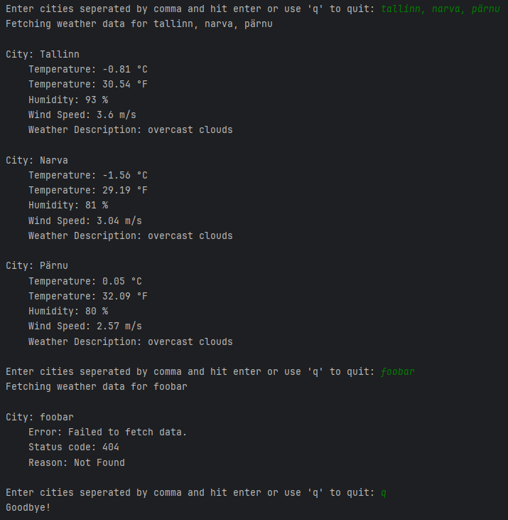

# weather-app
Simple console web weather application.

## Description
This console app allows user to get city/cities weather information by entering comma-separated city names.

The app uses OpenWeatherMap API to get weather information.

## How to run

NB! You will need an OpenWeatherMap API key. You can get it from https://openweathermap.org/api

#### Via Docker:
```bash
docker build -t weather-app .
```
 In the following command, replace `your_openweathermap_api_key` with your actual API key.
```bash
docker run -it --rm -e API_KEY=your_openweathermap_api_key weather-app
```

#### Locally:
1) Create .env file in the root directory
2) Add the following line to the .env file:
API_KEY=your_openweathermap_api_key
3) Run the program python/python3
```bash
python src/app.py
```

## Some key features
- User can get weather information of a single city.
- User can get weather information of multiple cities at once.
- Getting weather is asynchronous, so user can get weather information of multiple cities at once in a very short time.
- App uses cache to store weather information, so if user requests the same city weather information again in a short time, it will be retrieved from cache.


## Image
